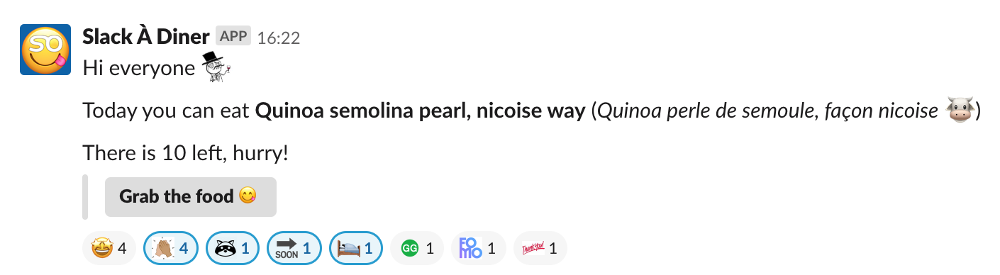

# SlackADiner

A SlackBot to let you know what is up for pret-a-diner tonight!

requires:

- sogeres (sohappy@work account)
- slackbot API token (SLACK_API_TOKEN environment variable)
- having pret-a-diner at your company's cantine
- python3
- set up Heroku scheduling for when the menu will be available

## Plans

- slash-command to see regular lunch menu
- send the regular lunch menu
- slash-command to ask for pret-a-diner menu
